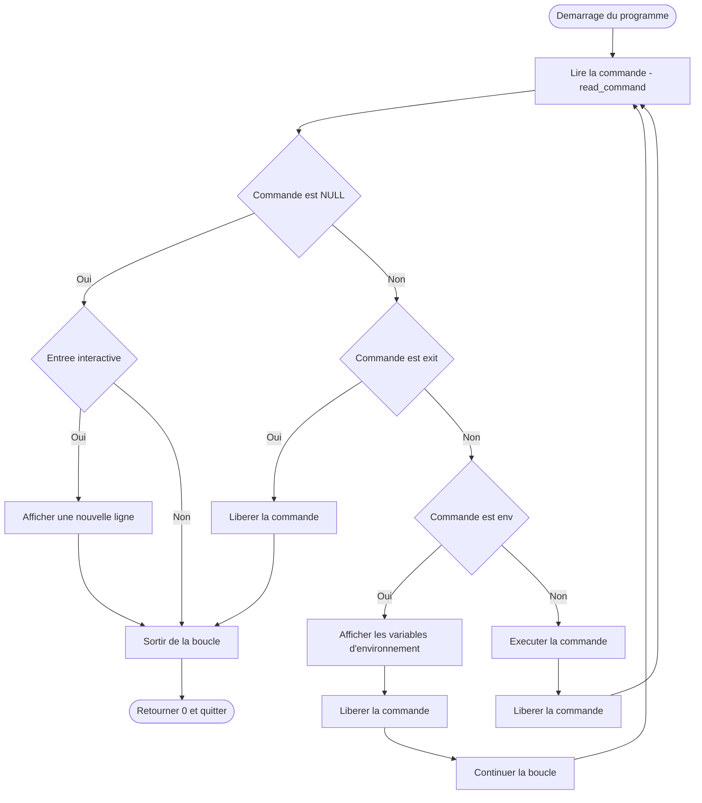

```mermaid
flowchart TD
	Start([Demarrage du programme])
	ReadCmd[Lire la commande - read_command]
	CmdNull{Commande est NULL}
	IsTTY{Entree interactive}
	PrintNewline[Afficher une nouvelle ligne]
	ExitLoop1[Sortir de la boucle]
	CmdExit{Commande est exit}
	FreeCmd1[Liberer la commande]
	CmdEnv{Commande est env}
	PrintEnv[Afficher les variables d'environnement]
	FreeCmd2[Liberer la commande]
	ContinueLoop[Continuer la boucle]
	ExecCmd[Executer la commande]
	FreeCmd3[Liberer la commande]
	End([Retourner 0 et quitter])

	Start --> ReadCmd
	ReadCmd --> CmdNull
	CmdNull -- Oui --> IsTTY
	IsTTY -- Oui --> PrintNewline --> ExitLoop1
	IsTTY -- Non --> ExitLoop1
	CmdNull -- Non --> CmdExit
	CmdExit -- Oui --> FreeCmd1 --> ExitLoop1
	CmdExit -- Non --> CmdEnv
	CmdEnv -- Oui --> PrintEnv --> FreeCmd2 --> ContinueLoop --> ReadCmd
	CmdEnv -- Non --> ExecCmd --> FreeCmd3 --> ReadCmd
	ExitLoop1 --> End
```
